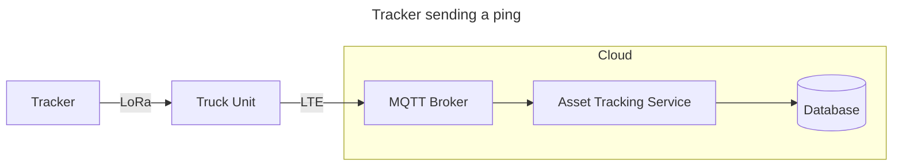
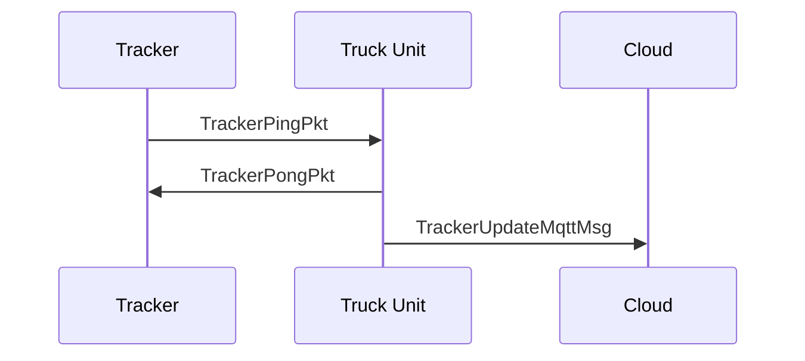
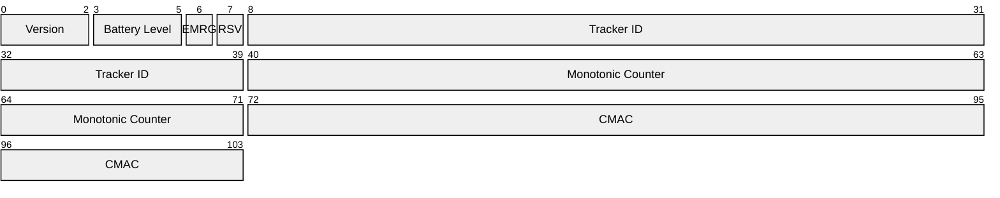
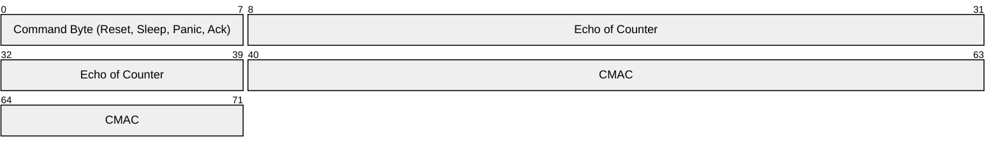
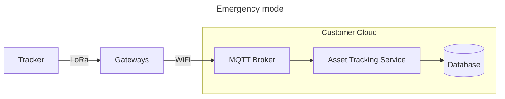
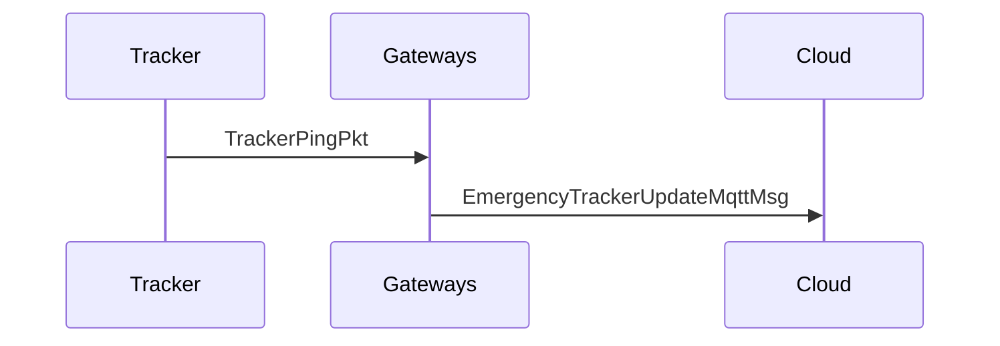

## Truck Mode


### TrackerPingPkt (13 bytes)
Little endian


### TrackerPongPkt (9 bytes)

### TrackerUpdateMqttMsg `/tracker/{trackerId}/truck-mode`
```proto
message TrackerUpdateMqttMsg {
    int32 version = 1;
    fixed32 tracker_id = 2;
    fixed32 counter = 3;
    
    int32 battery_level_approx = 4; // 0-15
    bool emergency_mode = 5;

    double truck_latitude = 6;
    double truck_longitude = 7;
    float truck_altitude = 8;
    
    int32 rssi = 9;
    float snr = 10;
    
    google.protobuf.Timestamp timestamp = 11;
}
```




### TrackerUpdateMqttMsg `/tracker/{trackerId}/emergency-mode`
```proto
message EmergencyTrackerUpdateMqttMsg {
    bytes tracker_ping_payload = 1;
    
    string gateway_id = 2;
    
    uint64 unix_timestamp = 3;
    uint64 timestamp_ns = 4;
    int32 rssi = 5;
    float snr = 6;
    
    double gateway_latitude = 7;
    double gateway_longitude = 8;
    float gateway_altitude = 9;
}
```